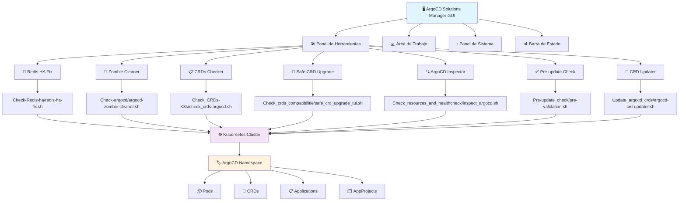

# 🚀 ArgoCD Solutions Manager

Una solución completa con interfaz gráfica para gestionar y ejecutar todas las herramientas de diagnóstico, mantenimiento y actualización de ArgoCD.

## 📋 Descripción

Este proyecto integra múltiples herramientas especializadas para ArgoCD en una interfaz gráfica única y fácil de usar. Permite ejecutar scripts de diagnóstico, limpieza, actualización y mantenimiento desde una sola aplicación.

## 🛠️ Herramientas Incluidas

### 🔧 Mantenimiento
- **Redis HA Fix**: Diagnostica y repara problemas de Redis HA en ArgoCD
- **Zombie Cleaner**: Limpia AppProjects con finalizers atorados

### 📋 Validación y Diagnóstico  
- **CRDs Checker**: Verifica compatibilidad de Custom Resource Definitions
- **ArgoCD Inspector**: Inspecciona configuración y estado de ArgoCD
- **Pre-update Check**: Validaciones antes de actualizar ArgoCD

### 🔄 Actualización
- **Safe CRD Upgrade**: Actualización segura de CRDs con interfaz TUI
- **CRD Updater**: Actualiza CRDs de ArgoCD a versiones específicas

## 📦 Requisitos

### Dependencias del Sistema
```bash
# Herramientas críticas
kubectl          # Cliente de Kubernetes
helm             # Gestor de paquetes Kubernetes  
git              # Control de versiones
jq               # Procesador JSON
yq               # Procesador YAML
```

### Dependencias de Python
```bash
# Python 3.8 o superior con tkinter
python3
python3-tk       # En Ubuntu/Debian
```

### Permisos de Kubernetes
- Acceso de lectura/escritura al namespace de ArgoCD
- Permisos para gestionar CRDs
- Acceso a recursos de ArgoCD (Applications, AppProjects, etc.)

## 🏗️ Arquitectura del Sistema



## 🚀 Instalación

### 1. Clonar el repositorio
```bash
git clone <repository-url>
cd Argocd-solutions
```

### 2. Instalar dependencias del sistema

#### 🐧 Ubuntu/Debian
```bash
# Actualizar sistema
sudo apt update

# Python y GUI
sudo apt install -y python3 python3-tk

# Herramientas básicas
sudo apt install -y git curl wget jq

# Instalar kubectl
curl -LO "https://dl.k8s.io/release/$(curl -L -s https://dl.k8s.io/release/stable.txt)/bin/linux/amd64/kubectl"
sudo install -o root -g root -m 0755 kubectl /usr/local/bin/kubectl
rm kubectl

# Instalar Helm
curl https://raw.githubusercontent.com/helm/helm/main/scripts/get-helm-3 | bash

# Instalar yq
sudo wget -qO /usr/local/bin/yq https://github.com/mikefarah/yq/releases/latest/download/yq_linux_amd64
sudo chmod +x /usr/local/bin/yq
```

#### 🍎 macOS
```bash
# Verificar Homebrew
which brew || /bin/bash -c "$(curl -fsSL https://raw.githubusercontent.com/Homebrew/install/HEAD/install.sh)"

# Instalar todas las dependencias
brew install python-tk kubectl helm git jq yq
```

#### 🎩 CentOS/RHEL/Fedora
```bash
# Herramientas básicas
sudo yum install -y python3 python3-tkinter git curl wget jq

# kubectl
curl -LO "https://dl.k8s.io/release/$(curl -L -s https://dl.k8s.io/release/stable.txt)/bin/linux/amd64/kubectl"
sudo install -o root -g root -m 0755 kubectl /usr/local/bin/kubectl
rm kubectl

# Helm
curl https://raw.githubusercontent.com/helm/helm/main/scripts/get-helm-3 | bash

# yq
sudo wget -qO /usr/local/bin/yq https://github.com/mikefarah/yq/releases/latest/download/yq_linux_amd64
sudo chmod +x /usr/local/bin/yq
```

#### 🐳 Docker/Containerized (Alternativa)
```bash
# Si prefieres usar contenedores
docker run --rm -it -v ~/.kube:/root/.kube -v $(pwd):/workspace \
  --workdir /workspace \
  python:3.9-slim bash -c "
    apt update && apt install -y python3-tk kubectl helm git jq wget && \
    wget -qO /usr/local/bin/yq https://github.com/mikefarah/yq/releases/latest/download/yq_linux_amd64 && \
    chmod +x /usr/local/bin/yq && \
    python3 argocd_manager_gui.py
  "
```

### 3. Enlaces de descarga directa

| Herramienta | Linux x64 | macOS | Windows | Documentación |
|-------------|-----------|-------|---------|---------------|
| **kubectl** | [📥 Descargar](https://dl.k8s.io/release/v1.28.0/bin/linux/amd64/kubectl) | [📥 Descargar](https://dl.k8s.io/release/v1.28.0/bin/darwin/amd64/kubectl) | [📥 Descargar](https://dl.k8s.io/release/v1.28.0/bin/windows/amd64/kubectl.exe) | [📖 Docs](https://kubernetes.io/docs/tasks/tools/) |
| **helm** | [📥 Script](https://raw.githubusercontent.com/helm/helm/main/scripts/get-helm-3) | [🍺 Homebrew](https://formulae.brew.sh/formula/helm) | [📥 Descargar](https://github.com/helm/helm/releases) | [📖 Docs](https://helm.sh/docs/) |
| **jq** | [📥 Descargar](https://github.com/stedolan/jq/releases/download/jq-1.6/jq-linux64) | [🍺 Homebrew](https://formulae.brew.sh/formula/jq) | [📥 Descargar](https://github.com/stedolan/jq/releases/download/jq-1.6/jq-win64.exe) | [📖 Docs](https://stedolan.github.io/jq/) |
| **yq** | [📥 Descargar](https://github.com/mikefarah/yq/releases/latest/download/yq_linux_amd64) | [🍺 Homebrew](https://formulae.brew.sh/formula/yq) | [📥 Descargar](https://github.com/mikefarah/yq/releases/latest/download/yq_windows_amd64.exe) | [📖 Docs](https://mikefarah.gitbook.io/yq/) |

### 4. Configurar permisos
```bash
# Hacer ejecutable el script principal
chmod +x argocd_manager_gui.py

# Hacer ejecutables todos los scripts de herramientas
find . -name "*.sh" -exec chmod +x {} \;
```

### 5. Verificar instalación
```bash
# Verificar todas las dependencias
echo "🔍 Verificando dependencias..."
python3 --version && echo "✅ Python3 OK" || echo "❌ Python3 falta"
python3 -c "import tkinter" 2>/dev/null && echo "✅ tkinter OK" || echo "❌ tkinter falta" 
kubectl version --client && echo "✅ kubectl OK" || echo "❌ kubectl falta"
helm version && echo "✅ helm OK" || echo "❌ helm falta"
git --version && echo "✅ git OK" || echo "❌ git falta"
jq --version && echo "✅ jq OK" || echo "❌ jq falta"
yq --version && echo "✅ yq OK" || echo "❌ yq falta"
```

### 6. Configurar acceso a Kubernetes
```bash
# Verificar conectividad
kubectl cluster-info

# Verificar contexto actual
kubectl config current-context

# Listar namespaces disponibles
kubectl get namespaces

# Verificar acceso al namespace de ArgoCD
kubectl get pods -n argocd
```

## 💻 Uso

### Ejecutar la aplicación
```bash
# Desde el directorio del proyecto
python3 argocd_manager_gui.py

# O usando el intérprete de Python
./argocd_manager_gui.py
```

### Interfaz de Usuario

La aplicación se divide en cuatro áreas principales:

#### 🛠️ Panel de Herramientas (Izquierda)
- Lista de todas las herramientas disponibles
- Categorización por tipo (Mantenimiento, Validación, Actualización)
- Tooltips con descripciones detalladas

#### 💻 Área de Trabajo (Centro)
- Información de la herramienta seleccionada
- Salida en tiempo real de la ejecución
- Controles de ejecución (Ejecutar, Detener, Limpiar, Exportar)

#### ℹ️ Panel de Información (Derecha)
- Estado del sistema y dependencias
- Información de Kubernetes
- Contexto actual y namespaces

#### 📊 Barra de Estado (Inferior)
- Estado actual de la aplicación
- Barra de progreso para ejecuciones activas

### Flujo de Trabajo Típico

1. **Seleccionar Herramienta**: Click en una herramienta del panel izquierdo
2. **Revisar Información**: Verificar descripción y requisitos
3. **Ejecutar**: Click en "▶️ Ejecutar" para iniciar
4. **Monitorear**: Observar la salida en tiempo real
5. **Exportar**: Guardar logs si es necesario

## 🚀 Interfaz Gráfica Moderna

### Ejecutar la Aplicación
```bash
# Interfaz moderna con tarjetas y diseño mejorado
python3 argocd_manager_modern_gui.py

# Interfaz clásica (disponible también)
python3 argocd_manager_gui.py
```

### Características de la GUI Moderna
- **🎨 Diseño Moderno**: Interfaz con tarjetas coloridas y categorización
- **📱 Organización por Pestañas**: Herramientas, Dashboard, Logs, Configuración
- **⚡ Ejecución en Tiempo Real**: Visualización inmediata de la salida
- **📊 Dashboard Integrado**: Métricas del sistema y estado de dependencias
- **🎯 Selección Visual**: Click directo en tarjetas para ejecutar herramientas
- **💾 Gestión de Logs**: Exportación y limpieza desde la interfaz

### Pestañas Disponibles
1. **🛠️ Herramientas**: Tarjetas organizadas por categorías con ejecución directa
2. **📊 Dashboard**: Métricas del sistema, estado de dependencias, información K8s
3. **📋 Logs**: Visualización en tiempo real, controles de ejecución, exportación
4. **⚙️ Configuración**: Configuración de namespace, timeouts, directorios

## 📚 Guía Completa de Herramientas

### 🔧 Redis HA Fix
**Uso**: Cuando ArgoCD tiene problemas de conectividad o rendimiento relacionados con Redis HA
**Funciones**:
- Diagnóstico completo de pods Redis
- Reinicio automático de pods problemáticos
- Verificación de configuración
- Monitoreo en tiempo real

**Características avanzadas**:
- Verificación de conectividad Redis
- Análisis de replicación y Sentinel
- Detección de problemas de autenticación
- Escalado automático de StatefulSets
- Generación de reportes detallados

### 🧹 Zombie Cleaner
**Uso**: Para limpiar AppProjects que quedaron en estado de eliminación
**Funciones**:
- Detección de AppProjects con finalizers atorados
- Verificación de aplicaciones activas
- Eliminación segura de finalizers
- Interfaz TUI interactiva

**Características avanzadas**:
- Confirmación interactiva por cada eliminación
- Logs con timestamp por cada acción
- UI TUI amigable con `rich` y `questionary`
- Verificaciones de seguridad antes de eliminar

### 📋 CRDs Checker
**Uso**: Antes de actualizar ArgoCD para verificar compatibilidad
**Funciones**:
- Análisis de compatibilidad de CRDs
- Comparación de versiones
- Recomendaciones de actualización
- Detección de problemas

**Características avanzadas**:
- Detección automática de instalaciones Argo CD (Helm y manual)
- Análisis de sincronización entre Argo CD y Argo Rollouts
- Información detallada del cluster EKS
- Verificación de API versions (v1alpha1, v1beta1)
- Compatibilidad específica con versiones de ArgoCD

### 🔄 Safe CRD Upgrade
**Uso**: Para actualizar CRDs de forma segura
**Funciones**:
- Backup automático de CRDs actuales
- Interfaz TUI para selección de versión
- Visualización de diferencias
- Aplicación confirmada

**Características avanzadas**:
- Menú con las últimas 10 versiones de ArgoCD desde GitHub
- Clonación automática del repo de ArgoCD en la versión elegida
- Validación con recursos existentes
- Diff vs versión actual antes de aplicar

### 🔍 ArgoCD Inspector
**Uso**: Para auditar la configuración actual de ArgoCD
**Funciones**:
- Inspección de configuración Helm
- Análisis de health checks
- Evaluación de recursos
- Reporte detallado en Markdown

**Características avanzadas**:
- Extracción de valores de configuración (server.url, dex.config, policy.csv)
- Evaluación de livenessProbe y readinessProbe
- Identificación de parámetros problemáticos con advertencias
- Análisis del uso actual de recursos (CPU/Memory)
- Exportación completa del reporte a Markdown

### ✅ Pre-update Check
**Uso**: Antes de cualquier actualización de ArgoCD
**Funciones**:
- Validación de estado de pods
- Verificación de configuración
- Análisis de recursos
- Lista de verificación pre-actualización

**Características avanzadas**:
- Verificación de Redis HA específicamente
- Análisis de aplicaciones (sync status, health status)
- Verificación de reinicios recientes de pods
- Funciones mejoradas para evitar falsos positivos
- Test de conectividad Redis con autenticación

### 🔧 CRD Updater
**Uso**: Para actualizar CRDs a versiones específicas
**Funciones**:
- Selección de versión objetivo
- Backup automático
- Actualización paso a paso
- Verificación post-actualización

**Características avanzadas**:
- Configuración específica para versión v2.14.11
- Creación de directorio de backup con timestamp
- Descarga automática de CRDs desde repositorio oficial
- Verificación de esquemas y compatibilidad
- Rollback automático en caso de fallo

### 🕵️ Orphan Analyzer *(NUEVO)*
**Uso**: Identificar y limpiar recursos huérfanos no gestionados por ArgoCD
**Funciones**:
- Escaneo completo de recursos del cluster
- Identificación de recursos no gestionados por ArgoCD
- Análisis de dependencias y seguridad
- Generación de scripts de limpieza seguros

**Características avanzadas**:
- Análisis de 15+ tipos de recursos Kubernetes
- Clasificación por nivel de riesgo (SAFE, MODERATE, RISKY)
- Detección de recursos huérfanos por patrones comunes
- Scripts de limpieza automatizados con verificación
- Reportes detallados en Markdown con estadísticas
- Exclusión automática de recursos del sistema

### 📊 Performance Monitor *(NUEVO)*
**Uso**: Monitoreo en tiempo real del rendimiento de ArgoCD
**Funciones**:
- Monitoreo de componentes ArgoCD
- Análisis de rendimiento de APIs
- Métricas de sincronización de aplicaciones
- Análisis de recursos Redis

**Características avanzadas**:
- Monitoreo configurable (duración, intervalos)
- Métricas de CPU/Memoria en tiempo real
- Análisis de tiempos de respuesta de APIs
- Monitoreo de estado de sincronización
- Alertas automáticas por alto uso de recursos
- Exportación de datos CSV para análisis
- Integración con Prometheus/Grafana

### 🔐 Security Analyzer *(NUEVO)*
**Uso**: Análisis comprehensivo de seguridad para instalaciones ArgoCD
**Funciones**:
- Análisis de autenticación y SSO
- Verificación de RBAC y autorización
- Evaluación de seguridad de red
- Auditoría de gestión de secretos

**Características avanzadas**:
- Sistema de puntuación de seguridad (0-100)
- Análisis de configuración Dex/OIDC
- Verificación de políticas RBAC
- Evaluación de exposición de servicios y TLS
- Análisis de fortaleza de passwords y claves SSH
- Reportes por categoría con priorización
- Recomendaciones específicas de remediación
- Integración with compliance (SOC2, ISO27001)

## 🔄 Flujos de Trabajo Recomendados

### 📋 Mantenimiento Rutinario Semanal
```bash
# 1. Verificar estado general
python3 argocd_manager_modern_gui.py
# Seleccionar: ArgoCD Inspector

# 2. Limpiar recursos huérfanos
# Seleccionar: Orphan Analyzer

# 3. Verificar rendimiento
# Seleccionar: Performance Monitor (5 min)

# 4. Análisis de seguridad básico
# Seleccionar: Security Analyzer
```

### 🚀 Pre-actualización de ArgoCD
```bash
# 1. Validaciones previas
# Seleccionar: Pre-update Check

# 2. Backup de CRDs actuales
# Seleccionar: CRDs Checker

# 3. Análisis de compatibilidad
# Seleccionar: CRDs Checker

# 4. Limpieza preventiva
# Seleccionar: Zombie Cleaner
# Seleccionar: Orphan Analyzer

# 5. Actualizar CRDs primero
# Seleccionar: Safe CRD Upgrade

# 6. Proceder con actualización de ArgoCD
helm upgrade argocd argo/argo-cd -n argocd

# 7. Verificación post-actualización
# Seleccionar: ArgoCD Inspector
# Seleccionar: Performance Monitor
```

### 🆘 Troubleshooting de Problemas
```bash
# Problema: ArgoCD lento o no responde
# 1. Verificar Redis HA
# Seleccionar: Redis HA Fix

# 2. Analizar rendimiento
# Seleccionar: Performance Monitor (10 min)

# 3. Revisar configuración
# Seleccionar: ArgoCD Inspector

# Problema: Aplicaciones no sincronizan
# 1. Limpiar recursos atorados
# Seleccionar: Zombie Cleaner

# 2. Verificar CRDs
# Seleccionar: CRDs Checker

# 3. Analizar recursos huérfanos
# Seleccionar: Orphan Analyzer
```

### 🔐 Auditoría de Seguridad Mensual
```bash
# 1. Análisis completo de seguridad
# Seleccionar: Security Analyzer

# 2. Verificar configuración actual
# Seleccionar: ArgoCD Inspector

# 3. Analizar recursos no gestionados
# Seleccionar: Orphan Analyzer

# 4. Monitor de rendimiento extendido
# Seleccionar: Performance Monitor (30 min)

# 5. Generar reporte de compliance
# Exportar todos los logs para documentación
```

### 🏥 Recuperación de Desastres
```bash
# 1. Diagnóstico inicial completo
# Seleccionar: ArgoCD Inspector
# Seleccionar: Performance Monitor

# 2. Verificar integridad de Redis
# Seleccionar: Redis HA Fix (modo diagnóstico)

# 3. Limpiar recursos corruptos
# Seleccionar: Zombie Cleaner
# Seleccionar: Orphan Analyzer

# 4. Verificar y reparar CRDs
# Seleccionar: Safe CRD Upgrade

# 5. Validación post-recuperación
# Seleccionar: Pre-update Check
# Seleccionar: Security Analyzer
```

### 📊 Monitoreo Continuo
```bash
# Script de monitoreo automatizado
#!/bin/bash
# Ejecutar cada hora via crontab
# 0 * * * * /path/to/monitoring_script.sh

# Usar Performance Monitor para métricas
python3 argocd_manager_modern_gui.py --script Performance_monitor/performance_monitor.sh -d 60

# Alertar si hay problemas
if [ $? -ne 0 ]; then
    # Enviar alerta a Slack/Teams
    curl -X POST $WEBHOOK_URL -d "ArgoCD monitoring alert"
fi
```

## 🔧 Solución de Problemas

### Error: "Dependencias Faltantes"
```bash
# Verificar qué herramientas faltan
which kubectl helm git jq yq python3

# Instalar las herramientas faltantes según tu OS
```

### Error: "No se puede conectar a Kubernetes"
```bash
# Verificar configuración
kubectl config current-context
kubectl cluster-info

# Configurar contexto si es necesario
kubectl config use-context <tu-contexto>
```

### Error: "Namespace 'argocd' no encontrado"
```bash
# Listar namespaces disponibles
kubectl get namespaces | grep argo

# Los scripts se pueden configurar para usar otros namespaces
```

### Error: "Script no encontrado"
```bash
# Verificar permisos de ejecución
find . -name "*.sh" -exec ls -la {} \;

# Hacer ejecutables si es necesario
find . -name "*.sh" -exec chmod +x {} \;
```

### Problemas de Interfaz Gráfica
```bash
# En sistemas sin X11/GUI
export DISPLAY=:0

# Para WSL/sistemas remotos, usar X11 forwarding
ssh -X usuario@servidor
```

## 📊 Logs y Exportación

### Exportar Logs
- Click en "💾 Exportar Log" para guardar la salida
- Los logs incluyen timestamps y información de contexto
- Formatos soportados: .log, .txt

### Ubicación de Logs
```bash
# Logs automáticos de algunas herramientas
logs/                    # Directorio de logs generales
crd_backups/            # Backups de CRDs
```

## 🔐 Consideraciones de Seguridad

### Permisos Mínimos
- Usar cuentas de servicio con permisos específicos
- No ejecutar como root/admin innecesariamente
- Revisar scripts antes de ejecutar en producción

### Backups
- Siempre hacer backup antes de cambios críticos
- Verificar backups antes de proceder
- Mantener múltiples versiones de backup

### Auditoría
- Revisar logs de todas las operaciones
- Documentar cambios realizados
- Mantener trazabilidad de modificaciones

## 🤝 Contribuir

### Reportar Problemas
1. Verificar que el problema no esté ya reportado
2. Incluir información completa del entorno
3. Proporcionar logs y pasos para reproducir
4. Especificar versiones de todas las herramientas

### Agregar Nueva Herramienta
1. Crear script en directorio apropiado
2. Actualizar lista de herramientas en `argocd_manager_gui.py`
3. Agregar documentación en README
4. Probar integración completa

### Mejoras Sugeridas
- [ ] Soporte para múltiples clusters
- [ ] Integración con sistemas de monitoreo
- [ ] Modo batch para ejecución automatizada
- [ ] Dashboard web opcional
- [ ] Integración con CI/CD

## 📄 Estructura Completa del Proyecto

```
Argocd-solutions/
├── argocd_manager_gui.py              # GUI clásica
├── argocd_manager_modern_gui.py       # GUI moderna (RECOMENDADA)
├── README.md                          # Documentación completa
├── requirements.txt                   # Dependencias de Python
├── .gitignore                        # Exclusiones de Git
│
├── Check-Redis-ha/                   # 🔧 Diagnóstico Redis HA
│   └── redis-ha-fix.sh              # Script principal
│
├── Check-argocd/                     # 🧹 Limpieza de recursos
│   ├── README.md                     # Documentación específica
│   ├── argocd-zombie-cleaner.sh     # Limpieza de AppProjects
│   └── logs/                        # Logs de ejecución
│
├── Check_CRDs-K8s/                   # 📋 Verificación de CRDs
│   ├── README.md                     # Guía detallada
│   ├── argo-sh/                     # Scripts adicionales
│   ├── argocd-crd-checker/          # Checker específico
│   └── check_crds-argocd.sh         # Script principal
│
├── Check_crds_compatibilitie/        # 🔄 Actualización segura
│   ├── README.md                     # Documentación
│   ├── SETUP.md                     # Guía de configuración
│   ├── safe_crd_upgrade_tui.sh      # Actualización TUI
│   ├── crd_backups/                 # Backups automáticos
│   └── tmp-argocd-v3.0.2/          # Repo temporal ArgoCD
│
├── Check_resources_and_healthcheck/  # 🔍 Inspección ArgoCD
│   ├── README.md                     # Documentación
│   ├── inspect_argocd.sh            # Inspector principal
│   └── argocd_inspection_report.md  # Reporte generado
│
├── Pre-update_check/                 # ✅ Validaciones previas
│   └── pre-validation.sh            # Validaciones mejoradas
│
├── Update_argocd_crds/              # 🔧 Actualización CRDs
│   ├── argocd-crd-updater.sh       # Actualizador principal
│   └── check-current-crds.sh       # Verificador actual
│
├── Orphan_resources_analyzer/        # 🕵️ Análisis de huérfanos (NUEVO)
│   ├── README.md                     # Documentación completa
│   └── orphan_analyzer.sh           # Analizador principal
│
├── Performance_monitor/              # 📊 Monitor de rendimiento (NUEVO)
│   ├── README.md                     # Guía de uso
│   └── performance_monitor.sh       # Monitor en tiempo real
│
└── Security_analyzer/               # 🔐 Análisis de seguridad (NUEVO)
    ├── README.md                    # Documentación detallada
    └── security_analyzer.sh        # Analizador de seguridad
```

### 📊 Estadísticas del Proyecto
- **🛠️ Total de Herramientas**: 10 herramientas especializadas
- **📄 Scripts Bash**: 15+ scripts automatizados
- **🐍 Interfaces Python**: 2 GUIs (clásica y moderna)
- **📚 Documentación**: 8 READMEs especializados
- **🎯 Categorías**: Mantenimiento, Validación, Actualización, Análisis, Monitoreo, Seguridad
- **🔧 Líneas de Código**: 5000+ líneas de código bash/python
- **📋 Casos de Uso**: 50+ escenarios cubiertos

## 📞 Soporte

### Documentación Adicional
- Cada directorio contiene su propio README específico
- Revisar logs en caso de errores
- Consultar documentación oficial de ArgoCD

### Contacto
- **Autor**: Jaime Andrés Henao
- **GitHub Issues**: Para reportar problemas
- **Contributions**: Pull requests bienvenidos

---

**⚡ Tip**: Ejecuta siempre las validaciones antes de hacer cambios en producción. Esta herramienta está diseñada para ser tu compañero confiable en la gestión de ArgoCD.

**🎯 Objetivo**: Simplificar la gestión de ArgoCD mediante una interfaz unificada que integre todas las herramientas especializadas necesarias para mantener un entorno GitOps saludable y actualizado.